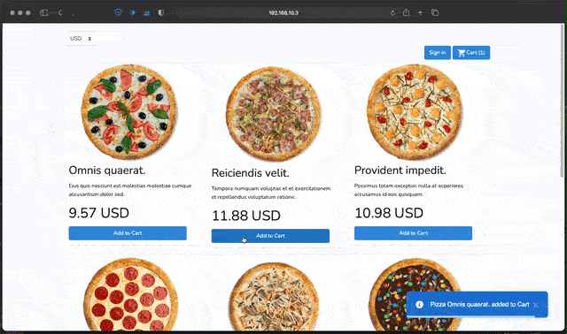

# fakepizza

Bootstrap 4.5/Vue 2.6/Laravel 8 - example Pizza app


> Inspiration from [https://github.com/mikovp/fakepizza](https://github.com/mikovp/fakepizza)



### Installation

1. Clone repo

2. Change to directory

````
cd fakepizza
````   

3. Install dependencies

````
composer install
````

4. Copy .env file

```
cp .env.example .env
```

5. Create `laravel` in your database.

6. Generate application key:

````
php artisan key:generate
````

7. Migrate/Seed
````
php artisan migrate:fresh --seed
````

8. Install Node modules
````
npm install
````

9. Build

````
npm run prod
````


